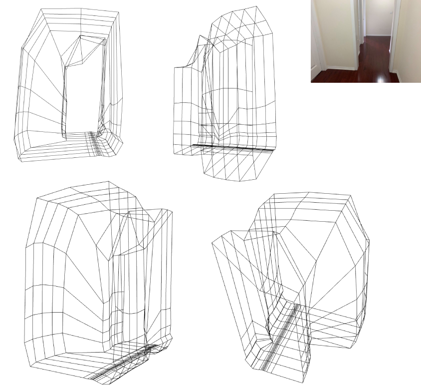

# Embedded-Spatial-Measurement-System
Designed and built an embedded spatial measurement system using a time-of-flight sensor to acquire information of the surrounding environment. 

The final 3D model after collecting 10 planes of measurements.
https://drive.google.com/file/d/1ZCbt4E3yTIUSqZMN9cD7OMf5mZZiIz5s/view?usp=sharing
